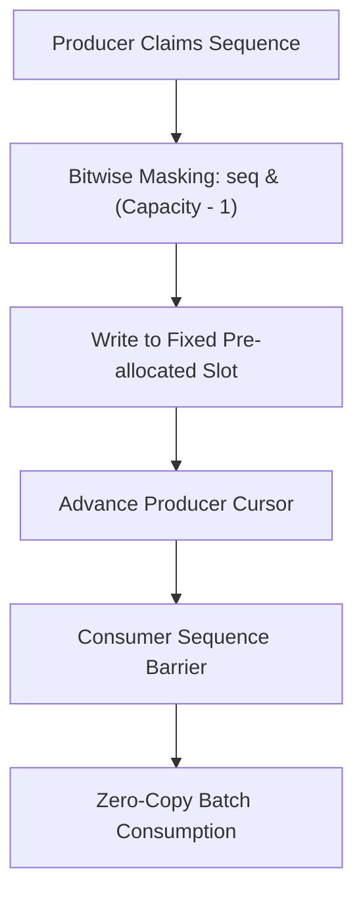

# genpark-disruptor-lock-free-ring-buffer-skill

Agent Skill implementing the **LMAX Disruptor Lock-Free Ring Buffer Pattern** with sequence barriers, power-of-two bitwise masking, and batch consumption.

## Architectural Overview

